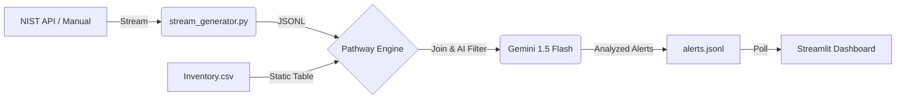

# Zero-Day Cyber Sentinel 🛡️

A real-time threat intelligence dashboard that fuses live NIST CVE data with your asset inventory, flags matches, and uses AI to explain the risk. Built on **Pathway** for streaming, powered by **Gemini** for analysis.

## 🚨 The Problem

In cybersecurity, **time is the enemy**. Traditional vulnerability management relies on:
1.  **Polling/Batching**: Checking for updates every few hours or days.
2.  **Manual Matching**: Spreadsheets to cross-reference thousands of CVEs with internal assets.
3.  **Slow Context**: Reading technical NVD descriptions to understand if a "High" severity actually affects *you*.

**Zero-Day Cyber Sentinel** solves this by moving from relatively static "management" to **real-time intelligence**. It ingests threats the second they appear, instantly filters them against your specific inventory, and uses AI to answer "Why does this matter?" immediately.

## 🔄 System Workflow

The system operates as a continuous streaming pipeline:



1.  **Ingestion ("The Ear")**: `stream_generator.py` continually polls the NIST NVD API for new vulnerability data. It also listens for manual overrides (Simulated Zero-Days).
2.  **Processing ("The Brain")**: `logic.py` (Pathway) reads this stream in real-time. It performs a **streaming join** with your `inventory.csv`. Only threats that match your software stack proceed.
3.  **Analysis ("The Analyst")**: Matched threats are sent to Google Gemini. The AI reads the technical CVE description and generates a concise, human-readable risk assessment.
4.  **Visualization ("The Face")**: `app.py` (Streamlit) watches the output and updates the dashboard instantly, alerting operators with toast notifications and emails.

## 🚀 Pathway Usage

[Pathway](https://pathway.com/) is the engine that makes this "Real-Time".
-   **Streaming Joins**: Instead of querying a database for every new CVE, Pathway maintains a state of the `inventory.csv` and "flows" the new CVEs through it.
-   **Windowing/Temporal Logic**: It handles the complexities of time-series data (like deduping recent events) without complex database queries.
-   **Python-Native**: The entire logic pipeline is written in standard Python, but executes with the speed of a Rust engine.

## 💡 Key Design Decisions

1.  **Hybrid Data Stream**: We mix real NIST data with simulated "fake" threats. This ensures the dashboard is always alive for demos, even if NIST is quiet.
2.  **JSONL as IPC**: We use `stream.jsonl` and `alerts.jsonl` as simple, file-based queues between processes. This decouples the components, making it easy to debug (you can just tail the file) and restart individual services without crashing the whole stack.
3.  **AI-First Analysis**: We don't just show the CVSS score. We force Gemini to explain *why* it's a risk. This bridges the gap between "CVE-2024-1234" and "Update your Nginx server now."

---

## 🛠️ Step-by-Step Setup Guide

Follow these steps to get the full system running locally.

### Prerequisites
-   Python 3.10+
-   A Google Cloud Project with Gemini API Access
-   (Optional) NIST NVD API Key for higher rate limits

### 1. Clone and Configure
Clone the repo and enter the directory:
```bash
git clone https://github.com/YourUsername/DataQuest.git
cd DataQuest
```

Create your environment file:
```bash
# Windows (PowerShell)
copy .env.example .env

# Linux/Mac
cp .env.example .env
```
**Edit `.env`** and paste your `GEMINI_API_KEY`.

### 2. Install Dependencies
It is recommended to use a virtual environment.
```bash
python -m venv venv
# Windows
.\venv\Scripts\activate
# Linux/Mac
source venv/bin/activate

pip install -r requirements.txt
```

### 3. Customize Inventory
Edit `inventory.csv` to match your "protected" assets.
```csv
product,version,vendor
nginx,1.18.0,nginx
tensorflow,2.4.0,google
...
```
*Note: The system only alerts on CVEs that match these products.*

### 4. Run the System (The "3-Terminal" Method)
Because this is a decoupled microservice architecture, you need to run the three components simultaneously. Open 3 separate terminals in the project folder:

**Terminal 1: The Data Stream**
Fetches data from NIST and writes to `stream.jsonl`.
```bash
python stream_generator.py
```

**Terminal 2: The Logic Engine**
Processes the stream using Pathway and Gemini.
```bash
python logic.py
```

**Terminal 3: The Dashboard**
Launches the UI.
```bash
streamlit run app.py
```

### 5. Access the Dashboard
Open your browser to [http://localhost:8501](http://localhost:8501).
You should see real-time data flowing in the "Live NIST Threat Intelligence" section.

## 🎩 Demo Tricks

**Inject a Critical Threat**:
To prove the real-time nature without waiting for a real hack:
1.  Go to the Dashboard sidebar or main area.
2.  Click **"🔥 Inject Demo Threat"**.
3.  Watch it appear instantly in the Stream, get processed by Pathway, Analyzed by Gemini, and pop up as a **CRITICAL ALERT** within seconds.

**Manual Command Line Injection**:
You can also inject via the terminal:
```bash
echo "CRITICAL: Backdoor found in Mainframe!" > manual_input.txt
```

## 📂 Project Structure

-   `stream_generator.py`: Data fetcher (NIST + Sim).
-   `logic.py`: Pathway streaming pipeline.
-   `app.py`: Streamlit frontend.
-   `utils/`: Helper modules for API clients.
-   `stream.jsonl`: Raw data buffer.
-   `alerts.jsonl`: Processed data buffer.
